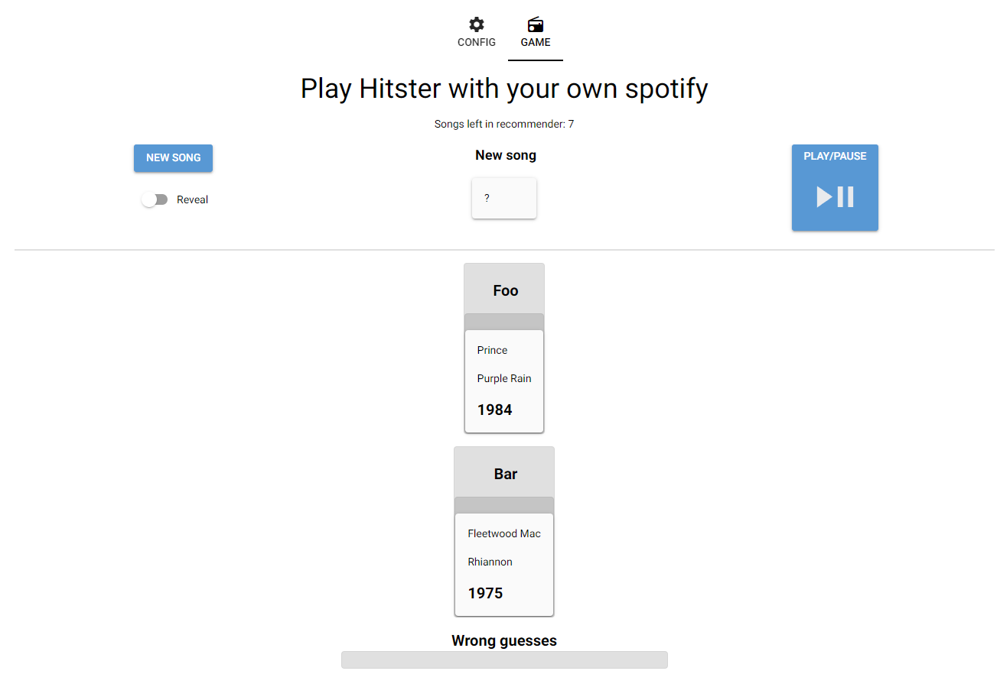

# My Own Spotify Hitster (or MOSH)
<p align="center">

</p>



Play Hitster with your own Spotify account based on your liked songs. (Future feature: based on a playlist).

Play alone or with friends.

This is still a work in progress. More features will (probably) be added.
The UI is also (clearly) a work in progress.

# Create necessary credentials
1. Create an "app" for your spotify account: https://developer.spotify.com/dashboard
   1. Choose a name and a description as you see fit
   2. Redirect URIs is supposed to be `http://localhost:8080`
   3. APIs used are: `Web API` and `Web Playback SDK`
2. Create a `.env`-file (copy/rename `.env.sample`)
3. Fill in your credentials in the `env`-file

# Run the app
1. Install [uv](https://docs.astral.sh/uv/getting-started/installation/)
2. Install dependencies:
```shell
uv sync
```
3. Start app:
```shell
python src\main.py
```
